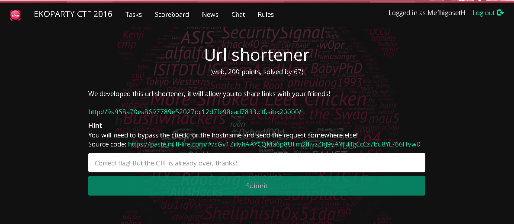
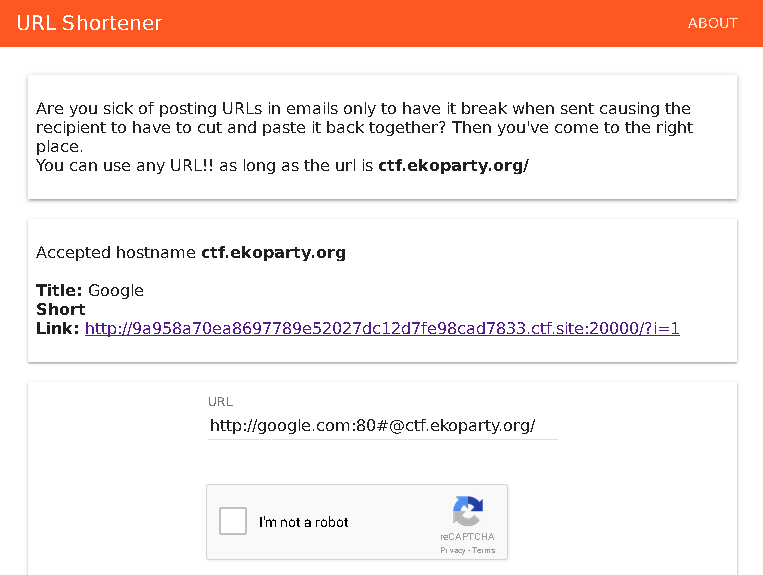

# Task WEB200: Url shortener

## Solution

Analize the PHP source code and you can see that the script use the parse_url() PHP function.

Use the precedure explained here https://bugs.php.net/bug.php?id=73192 to bypass the hostname check.

Last, send the request to a server that you own, so you can get the flag in the HTTP Referer request header.

`52.206.74.229 - - [28/Oct/2016:02:44:44 -0300] 0/479 "GET / HTTP/1.1" 302 223 "-" "EKO{follow_the_rfc_rabbit}"`
